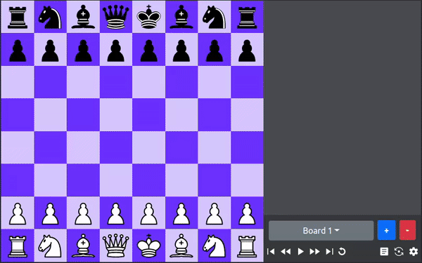

# Chess UI 1.0.1
A react ui library for integrating chess into web apps and analyzing chess games.


## Features

- Multiboard: analyze/play multiple games at same time
- FEN, PGN support
- Highlights: check, weak pieces and checkmate move
- Color themes

## Getting started

```javascript
    import React from 'react';
    import {ChessUI} from 'chess-ui';

    const function Main(){
        return (
            <div>
                <ChessUI width={500} />
            </div>
        )
    }
```

## Chess UI app



<>

## Future

- Advanced move analysis for weak positions
- Edit Mode for on-board piece placements rather by FEN 
- Stockfish AI integration for gameplay with bot
- Inbuilt Websocket API for real time online game play

## Contribute

Please do open issue for any bug fixes or required features for improving the standard of the library.